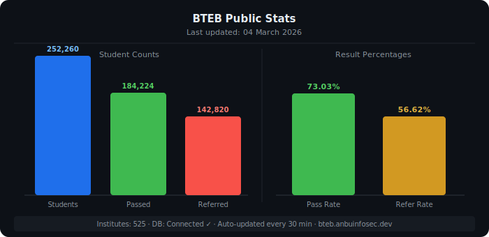

# bteb-result

> bteb.anbuinfosec.dev public stats updater.

[](https://bteb.anbuinfosec.dev)
[](https://bteb.anbuinfosec.dev/api/stats/public)

---

## 📊 Live Public Stats (Auto Updated Every 30 Minutes)

<!-- STATS:START -->
| Metric | Value |
|--------|--------|
| Database Connected | Yes |
| Total Students | 252,260 |
| Total Institutes | 525 |
| Total Passed | 184,224 |
| Total Referred | 142,820 |
| Pass Percentage | 73.03% |
| Refer Percentage | 56.62% |
| Last Result Published | 22 January 2026, 03:49 AM BST |
<!-- STATS:END -->

---

## 🔌 Public API Endpoints

<!-- API:START -->
### GET /api/stats/public

Returns aggregated public statistics.

**Response:**

```json
{
  "success": true,
  "data": {
    "connected": true,
    "studentCount": 252260,
    "instituteCount": 525,
    "passCount": 184224,
    "refCount": 142820,
    "passPercentage": 73.03,
    "refPercentage": 56.62,
    "lastResultPublished": "2026-01-21T21:49:14.325Z"
  }
}
```
<!-- API:END -->

---

## 📈 Live Stats Graph

<!-- CHART:START -->

<!-- CHART:END -->

---

## 🕐 Last Updated

<!-- UPDATED:START -->
| Field | Value |
|-------|-------|
| Last Auto-Update | 4 March 2026, 05:52 PM BST |
| Update Frequency | Every 30 minutes |
| Timezone | Asia/Dhaka (BST, UTC+6) |
<!-- UPDATED:END -->

---

> Auto-updated every 30 minutes via GitHub Actions. Powered by [bteb.anbuinfosec.dev](https://bteb.anbuinfosec.dev).
