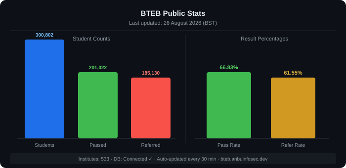

# bteb-result

> bteb.anbuinfosec.dev public stats updater.

[](https://bteb.anbuinfosec.dev)
[](https://bteb.anbuinfosec.dev/api/stats/public)

---

## 📊 Live Public Stats (Auto Updated Every 25 Days)

<!-- STATS:START -->
| Metric | Value |
|--------|--------|
| Database Connected | Yes |
| Total Students | 300,802 |
| Total Institutes | 533 |
| Total Passed | 201,022 |
| Total Referred | 185,130 |
| Pass Percentage | 66.83% |
| Refer Percentage | 61.55% |
| Last Result Published | 28 April 2026, 09:14 PM BST |
<!-- STATS:END -->

---

## 🔌 Public API Endpoints

<!-- API:START -->
### GET /api/stats/public

Returns aggregated public statistics.

**Response:**

```json
{
  "success": true,
  "data": {
    "connected": true,
    "studentCount": 300802,
    "instituteCount": 533,
    "passCount": 201022,
    "refCount": 185130,
    "passPercentage": 66.83,
    "refPercentage": 61.55,
    "lastResultPublished": "2026-04-28T15:14:26.721Z"
  }
}
```
<!-- API:END -->

---

## 📈 Live Stats Graph

<!-- CHART:START -->

<!-- CHART:END -->

---

## 🕐 Last Updated

<!-- UPDATED:START -->
| Field | Value |
|-------|-------|
| Last Auto-Update | 26 May 2026, 08:13 AM BST |
| Update Frequency | Every 30 minutes |
| Timezone | Asia/Dhaka (BST, UTC+6) |
<!-- UPDATED:END -->

---

> Auto-updated every 30 minutes via GitHub Actions. Powered by [bteb.anbuinfosec.dev](https://bteb.anbuinfosec.dev).
